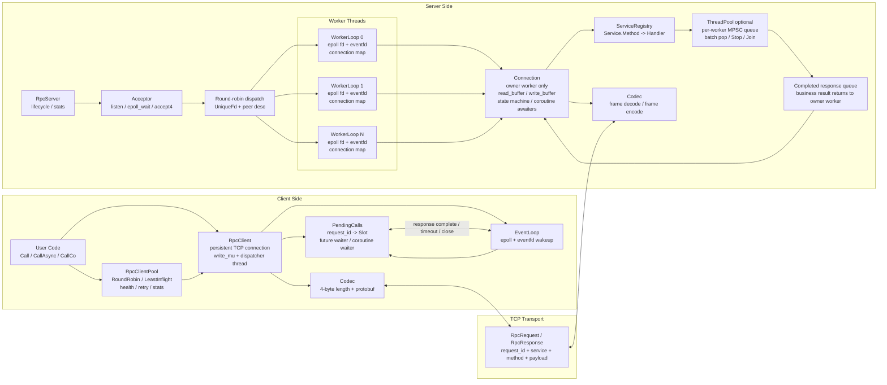

# C++20 Linux RPC Framework

一个基于 **C++20、Protobuf、Linux TCP Socket 与 epoll** 实现的轻量级 RPC 框架项目，重点实践网络 I/O、多线程事件驱动、异步结果分发、协程调用、连接池与性能评估。

项目不是简单的阻塞式 demo，而是围绕真实 C++ 后端常见问题逐步展开：连接生命周期、线程边界、请求乱序返回、超时收敛、关闭竞态、业务线程池回投、客户端负载均衡与 benchmark。

## Highlights

- 自定义长度前缀协议：`[4 bytes length][protobuf message]`
- 通用 RPC 模型：`RpcRequest / RpcResponse` 承载任意业务 payload
- 服务端采用 `RpcServer + WorkerLoop + Connection` 分层
- 多 worker 架构：Acceptor 负责接入，WorkerLoop 采用 one-loop-per-thread 驱动连接
- Connection 绑定 owner worker，避免连接状态跨线程共享
- 支持同步调用、`std::future` 异步调用与 C++20 coroutine 调用
- `PendingCalls` 基于 `request_id` 分发响应，支持多 in-flight 和乱序响应匹配
- 客户端连接池 `RpcClientPool`，支持 RoundRobin 与 LeastInflight
- 支持心跳、超时、连接关闭收敛、失败节点剔除与同步调用重试
- 服务端可配置业务线程池，handler 执行与连接 I/O 线程解耦
- 线程池基于每 worker 一个 MPSC ring queue，降低提交路径锁竞争
- 提供 22 个自动化测试，覆盖协议、客户端、协程、服务端连接、线程池、心跳与连接池
- 提供 benchmark suite，覆盖 baseline、pipeline、多连接、连接池、线程池与异步日志

## Architecture

### High-Level View

```text
                         ┌─────────────────────────────┐
                         │          RpcClient          │
                         │ Call / CallAsync / CallCo   │
                         └──────────────┬──────────────┘
                                        │
                         ┌──────────────▼──────────────┐
                         │        PendingCalls         │
                         │ request_id -> waiter/result │
                         └──────────────┬──────────────┘
                                        │ TCP
                                        ▼
┌────────────────────────────────────────────────────────────────────┐
│                             RpcServer                              │
│                                                                    │
│  ┌──────────────┐      round-robin       ┌──────────────────────┐  │
│  │   Acceptor   │ ─────────────────────▶ │      WorkerLoop       │  │
│  │ listen/accept│                        │ epoll + connections   │  │
│  └──────────────┘                        └──────────┬───────────┘  │
│                                                     │              │
│                                          ┌──────────▼───────────┐  │
│                                          │      Connection       │  │
│                                          │ read/write/state/co   │  │
│                                          └──────────┬───────────┘  │
│                                                     │              │
│                                          ┌──────────▼───────────┐  │
│                                          │   ServiceRegistry     │  │
│                                          │ Service.Method -> fn  │  │
│                                          └──────────┬───────────┘  │
│                                                     │              │
│                          optional business pool     ▼              │
│                                          ┌──────────────────────┐  │
│                                          │      ThreadPool       │  │
│                                          │ MPSC queues + workers │  │
│                                          └──────────────────────┘  │
└────────────────────────────────────────────────────────────────────┘
```

### Detailed View



一次请求的主路径：

1. 调用方通过 `RpcClient` 或 `RpcClientPool` 发起 `Call / CallAsync / CallCo`。
2. 客户端生成 `request_id`，在 `PendingCalls` 中注册 future waiter 或 coroutine waiter。
3. 请求被编码为长度前缀 frame，通过长连接写入 TCP。
4. 服务端 `Acceptor` 接收连接，并按 round-robin 投递给某个 `WorkerLoop`。
5. `WorkerLoop` 在 owner 线程中驱动 `Connection`，完成读缓冲、拆帧、反序列化和状态推进。
6. `Connection` 根据 `service_name + method_name` 查找 `ServiceRegistry`。
7. handler 可 inline 执行，也可提交到业务 `ThreadPool`。
8. 业务线程完成后不直接触碰连接，而是把响应回投到 owner worker。
9. owner worker 将响应写入 `Connection::write_buffer`，等待可写事件 flush。
10. 客户端 dispatcher 线程收到响应后按 `request_id` 完成对应 waiter。

## Core Design

### Protocol

传输层使用 4 字节大端长度头解决 TCP 粘包/半包问题，消息体使用 Protobuf 序列化。

```proto
message RpcRequest {
  string request_id = 1;
  string service_name = 2;
  string method_name = 3;
  bytes payload = 4;
}

message RpcResponse {
  string request_id = 1;
  ErrorCode error_code = 2;
  string error_msg = 3;
  bytes payload = 4;
}
```

框架层只处理通用 RPC envelope，业务层自行解析 `payload`。当前 demo 包含 `CalcService.Add`，并预留了 `user.proto` 作为更复杂业务消息示例。

### Server

服务端由三层组成：

- `RpcServer`：监听端口、accept 新连接、按 round-robin 分发给 worker
- `WorkerLoop`：每个 worker 独立线程运行 epoll，接管连接和事件调度
- `Connection`：维护单连接状态、读写缓冲、协议拆帧、协程等待点和关闭收敛

线程边界：

- `Connection` 只在 owner worker 线程访问
- Acceptor 不直接操作连接状态，只投递 fd
- 业务线程池不直接访问 `Connection`，处理结果通过 completed-response 队列回投 owner worker

### Client

客户端维护长连接和 dispatcher 线程：

- `Call`：同步调用，基于 `CallAsync().get()`
- `CallAsync`：返回 `std::future<RpcCallResult>`
- `CallCo`：返回 `Task<RpcCallResult>`，通过 coroutine waiter 直接绑定 pending slot
- `PendingCalls`：维护 `request_id -> result slot`，支持 future waiter 与 coroutine waiter 共存
- `EventLoop`：单连接 epoll wait，用于 dispatcher 线程监听可读事件和 wakeup

### Client Pool

`RpcClientPool` 在多个 endpoint 上封装多个独立 `RpcClient`：

- 支持 `RoundRobin`
- 支持 `LeastInflight`
- 支持预热 `Warmup()`
- 支持 endpoint stats
- 同步 `Call` 支持连接类错误下自动重试其他健康节点
- 异步与协程路径保持选择后转发，不做撤回式重试

### Thread Pool

服务端业务线程池用于把耗时 handler 从 I/O worker 中卸载。

当前线程池实现特点：

- 固定 worker 数
- 每个 worker 一个 bounded `MpscRingQueue`
- producer 通过 CAS 申请槽位
- consumer 批量 `PopBatch`
- 使用 `pending` 原子计数提供统计快照
- 提供 `Start / Submit / Stop / Join`

## Module Map

```text
proto/
  rpc.proto                         通用 RPC envelope 与错误码
  calc.proto                        CalcService demo 消息
  user.proto                        UserService 示例消息

src/protocol/
  codec.*                           长度前缀协议编解码

src/common/
  unique_fd.h                       fd RAII
  rpc_error.*                       统一错误码、Status、RpcException
  async_logger.*                    异步日志
  thread_pool.*                     业务线程池
  mpsc_ring_queue.h                 MPSC ring queue

src/client/
  rpc_client.*                      单连接 RPC 客户端
  pending_calls.*                   request_id 分发与 waiter 管理
  event_loop.*                      客户端 dispatcher epoll loop
  rpc_client_pool.*                 多 endpoint 客户端连接池
  load_balancer.*                   RoundRobin / LeastInflight

src/server/
  rpc_server.*                      Acceptor 与服务端生命周期
  worker_loop.*                     worker epoll loop
  connection.*                      单连接协议、状态机、协程等待点
  service_registry.*                服务注册与查找

src/coroutine/
  task.h                            C++20 Task 与 SyncWait

src/demo/
  server_main.cpp                   CalcService.Add 服务端 demo
  client_main.cpp                   同步客户端 demo
  coroutine_client_main.cpp         coroutine 客户端 demo
```

## Build

### Requirements

- Linux
- CMake
- g++ with C++20 support
- Protobuf / protoc
- pthread

Ubuntu / Debian:

```bash
sudo apt update
sudo apt install -y cmake g++ protobuf-compiler libprotobuf-dev
```

### Debug Build

```bash
cmake -S . -B build-debug -DCMAKE_BUILD_TYPE=Debug
cmake --build build-debug -j
```

### Release Build

```bash
cmake -S . -B build-release -DCMAKE_BUILD_TYPE=Release
cmake --build build-release -j
```

## Quick Start

启动服务端：

```bash
./build-debug/rpc_server_demo
```

另开终端运行同步客户端：

```bash
./build-debug/rpc_client_demo
```

预期输出：

```text
Add(1,2) = 3
```

运行 coroutine 客户端：

```bash
./build-debug/rpc_coroutine_client_demo
```

预期输出：

```text
[co] Add(1,2) = 3
```

## Testing

列出测试：

```bash
cd build-debug
ctest -N
```

运行全部测试：

```bash
cd build-debug
ctest --output-on-failure
```

当前测试覆盖 22 个目标：

```text
event_loop_test
codec_test
service_registry_test
e2e_test
out_of_order_dispatcher_test
call_async_timeout_test
call_async_close_test
call_co_basic_test
call_co_out_of_order_test
call_co_timeout_test
call_co_close_test
call_mixed_waiters_test
pending_calls_test
call_co_edge_cases_test
server_connection_test
server_connection_coroutine_test
server_worker_loop_test
server_multi_connection_test
server_multi_worker_loop_test
server_thread_pool_integration_test
heartbeat_test
rpc_client_pool_test
```

最近一次验证：

```text
build-debug: 22/22 tests passed
```

## Benchmarks

推荐使用 Release 构建运行 benchmark：

```bash
cmake -S . -B build-release -DCMAKE_BUILD_TYPE=Release
cmake --build build-release -j
LOG_LEVEL=off ./scripts/run_benchmarks.sh build-release
```

脚本会运行：

- `rpc_benchmark`：基础 sync/async/co latency 与 QPS
- `rpc_benchmark_pipeline`：单连接多 in-flight pipeline
- `rpc_benchmark_conn_pool`：多连接 × 每连接 depth
- `rpc_client_pool_benchmark`：RoundRobin / LeastInflight 分发策略
- `rpc_thread_pool_benchmark`：inline handler vs business thread pool
- `thread_pool_benchmark`：ThreadPool 架构 microbenchmark

结果写入 `benchmarks/results/run_YYYYMMDD_HHMMSS/`，包含 CSV/TXT + 自动生成的 `summary.md`。

### 代表性结果 (Release -O3, 4-core Xeon Gold 6254, loopback, log=off)

| Benchmark | 关键指标 |
|-----------|---------|
| Baseline sync RPC | p50 ≈ 70-100us, QPS ≈ 40k (1000 req, 并发 8) |
| Pipeline depth=64 | QPS ≈ 51k, p99 ≈ 42ms (50k req, 单连接) |
| Conn Pool 8×32 | QPS ≈ 71k, p99 ≈ 45ms |
| ClientPool RoundRobin | 分发均匀 (33.3%/endpoint), QPS ≈ 68k |
| ClientPool LeastInflight | fast:slow ≈ 95:5 分发偏快节点, QPS ≈ 24k |
| ThreadPool E2E (20ms sleep) | inline → pool: QPS 翻倍, p95 从 221ms → 80ms |
| ThreadPool microbench (4w×32p) | p50: 12ms → 120us (100x), QPS 1.8x |

### 单独运行示例

```bash
./build-release/rpc_benchmark --mode=sync --requests=5000 --concurrency=8 --log=off
./build-release/rpc_benchmark_pipeline --requests=50000 --depth=32 --payload_bytes=64 --log=off
./build-release/rpc_benchmark_conn_pool --requests=100000 --conns=8 --depth=32 --payload_bytes=64 --log=off
./build-release/rpc_client_pool_benchmark --scenario=least_inflight --requests=50000 --payload_bytes=64 --concurrency=8 --output_dir=benchmarks/results/tmp
./build-release/rpc_thread_pool_benchmark 1024 16 20 benchmarks/results/tmp
```

> **注意**: 以上为单机 loopback 数据，不等同网络场景。详细信息见 `benchmarks/results/run_*/summary.md`。

## Reliability Scenarios Covered

测试覆盖的关键场景包括：

- TCP 半包、多包、非法 frame
- protobuf 解析失败
- 未注册方法返回 `METHOD_NOT_FOUND`
- handler 抛异常返回 `INTERNAL_ERROR`
- 多 in-flight 请求乱序响应匹配
- `CallAsync` 超时隔离
- `CallAsync` 连接关闭收敛
- `CallCo` 正常、超时、关闭、乱序响应
- future waiter 与 coroutine waiter 混合
- server connection coroutine 读写挂起/恢复
- WorkerLoop 跨线程连接投递
- 多 worker 分发
- 服务端业务线程池回投
- 心跳检测
- 客户端连接池负载均衡、失败剔除与重试

## Roadmap

- 增加 CI：Debug / Release / CTest / Sanitizer
- 增加 ASan、UBSan、TSan 专项测试入口
- [x] 补充更完整的 benchmark 结果表格和机器配置 → `benchmarks/results/run_20260430_112749/`
- 增加更细粒度 per-request cancellation
- 增加 backpressure 策略和队列满时的可配置行为
- 增加 TLS / 鉴权 / 服务发现等生产化能力
- 评估 io_uring 版本 I/O backend

## Limitations

这个项目当前定位是 C++ 后端与基础架构方向的工程实践，不是完整生产级 RPC 框架。

当前尚未包含：

- TLS 加密与认证授权
- 服务发现、注册中心、配置中心
- 跨进程 tracing / metrics 导出
- 自动 IDL 代码生成框架
- 多协议兼容
- 完整流式 RPC
- 跨平台网络抽象

## Resume Keywords

适合在简历中概括为：

```text
基于 C++20 / Linux epoll / Protobuf 实现轻量级 RPC 框架，支持同步、future 异步与 coroutine 调用；服务端采用 Acceptor + 多 WorkerLoop 架构，连接绑定 owner worker；实现 request_id 分发、连接池、负载均衡、心跳检测、超时收敛、业务线程池和 benchmark suite，并通过 22 个自动化测试覆盖并发与生命周期场景。
```
