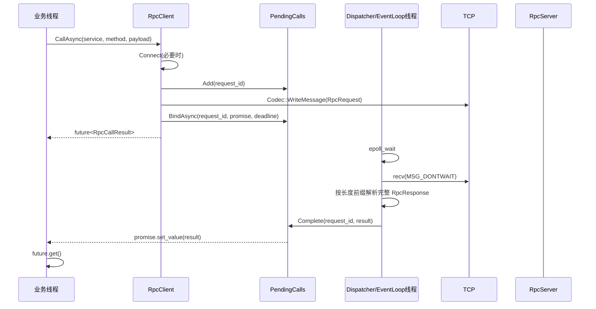

# mini_RPC 架构全景与关键流程图

## 总体分层

```mermaid
flowchart TB
  subgraph APP[业务层]
    CMAIN[client_main]
    SMAIN[server_main]
  end

  subgraph CLIENT[客户端框架层]
    RC[RpcClient\nCallAsync/Call]
    EL[EventLoop\nepoll+eventfd]
    PC[PendingCalls\nrequest_id -> slot]
  end

  subgraph SERVER[服务端框架层]
    RS[RpcServer]
    REG[ServiceRegistry]
  end

  subgraph PROTO[协议层]
    CODEC[Codec\n[4-byte len][protobuf]]
    PB[RpcRequest/RpcResponse\nAddRequest/AddResponse]
  end

  subgraph COMMON[公共层]
    ERR[rpc_error\nstd::error_code]
    UFD[UniqueFd]
    LOG[Log]
  end

  CMAIN --> RC
  RC --> EL
  RC --> PC
  RC --> CODEC
  RS --> REG
  RS --> CODEC
  CODEC --> PB

  RC --> ERR
  RS --> ERR
  RC --> UFD
  RS --> UFD
  RC --> LOG
  RS --> LOG
```

## 客户端请求时序（CallAsync）



## 关键接口与库函数映射

- RpcClient
  - Connect / Close / CallAsync / Call / DispatcherLoop
- EventLoop
  - Init / SetReadFd / WaitOnce / Wakeup
- PendingCalls
  - Add / BindAsync / Complete / FailTimedOut / FailAll
- Codec
  - ReadMessage / WriteMessage

Linux/系统调用：
- socket / connect / setsockopt / shutdown / recv / send
- epoll_create1 / epoll_ctl / epoll_wait
- eventfd / read / write

标准库与并发：
- std::future / std::promise
- std::thread / std::mutex / std::condition_variable

## 读路径 Reactor 职责

- EventLoop 负责 I/O readiness（可读事件、超时 tick、wakeup）
- DispatcherLoop 负责读取字节、组帧、反序列化、按 request_id 分发完成
- PendingCalls 负责请求-响应关联与 future 完成/超时/失败收敛

这个结构是从“阻塞读循环”到“事件驱动读路径”的最小演进，保持可学习且为后续 coroutine 铺路。
