# RPC 框架架构图集

本文档包含 RPC 框架的完整架构图，使用 Mermaid 格式绘制。

---

## 1. 整体架构分层图

```mermaid
flowchart TB
    subgraph BIZ[业务层 Business Layer]
        direction LR
        CLIENT_BIZ[Client Demo<br/>calc::AddRequest]
        SERVER_BIZ[Server Demo<br/>CalcService.Register]
    end

    subgraph FRAMEWORK[框架层 Framework Layer]
        direction TB
        subgraph CLIENT[客户端 Client]
            RC[RpcClient<br/>Call/CallAsync/CallCo]
            EL[EventLoop<br/>epoll+eventfd]
            PC[PendingCalls<br/>request_id → slot]
        end
        subgraph SERVER[服务端 Server]
            RS[RpcServer<br/>Acceptor]
            WL[WorkerLoop<br/>one-loop-per-thread]
            CONN[Connection<br/>协程驱动]
            REG[ServiceRegistry<br/>方法注册表]
        end
    end

    subgraph PROTO[协议层 Protocol Layer]
        CODEC[Codec<br/>[4-byte len][protobuf]]
        RPC_MSG[RpcRequest / RpcResponse]
        BIZ_MSG[业务消息<br/>AddRequest / AddResponse]
    end

    subgraph COROUTINE[协程层 Coroutine Layer]
        TASK[Task<T>]
        AWAITER[FutureAwaiter<br/>ReadAwaiter/WriteAwaiter]
    end

    subgraph COMMON[公共基础层 Common Layer]
        ERR[rpc_error<br/>std::error_code]
        UFD[UniqueFd<br/>RAII fd]
        LOG[Log<br/>std::source_location]
    end

    CLIENT_BIZ --> RC
    SERVER_BIZ --> REG
    
    RC --> EL
    RC --> PC
    RC --> CODEC
    
    RS --> WL
    WL --> CONN
    CONN --> REG
    CONN --> CODEC
    
    RC --> TASK
    CONN --> AWAITER
    
    CODEC --> RPC_MSG
    CODEC --> BIZ_MSG
    
    RC --> ERR
    RS --> ERR
    RC --> UFD
    RS --> UFD
```

---

## 2. 服务端架构详图

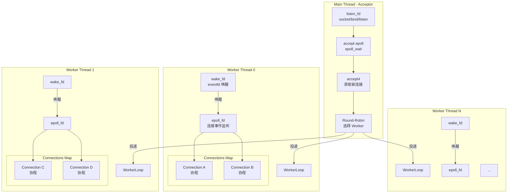

---

## 3. 客户端架构详图

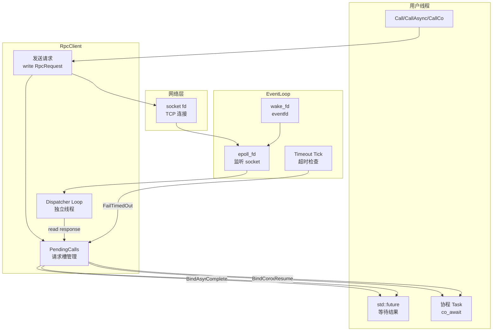

---

## 4. 请求响应完整时序图

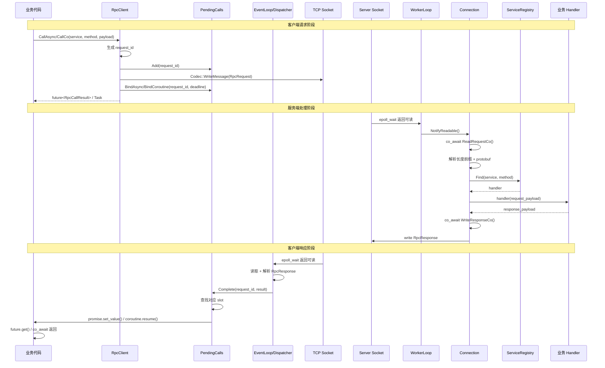

---

## 5. 服务端连接协程流程图

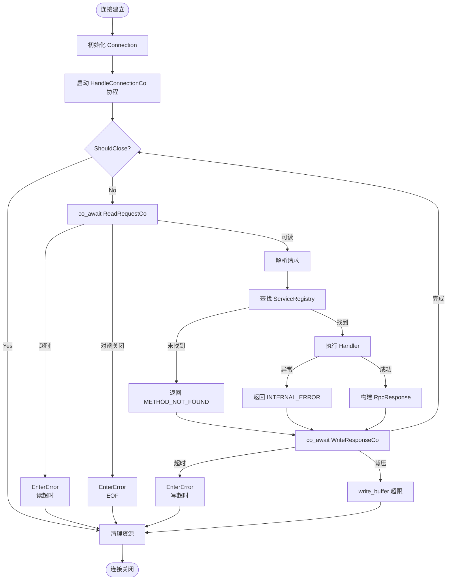

---

## 6. PendingCalls 状态管理图

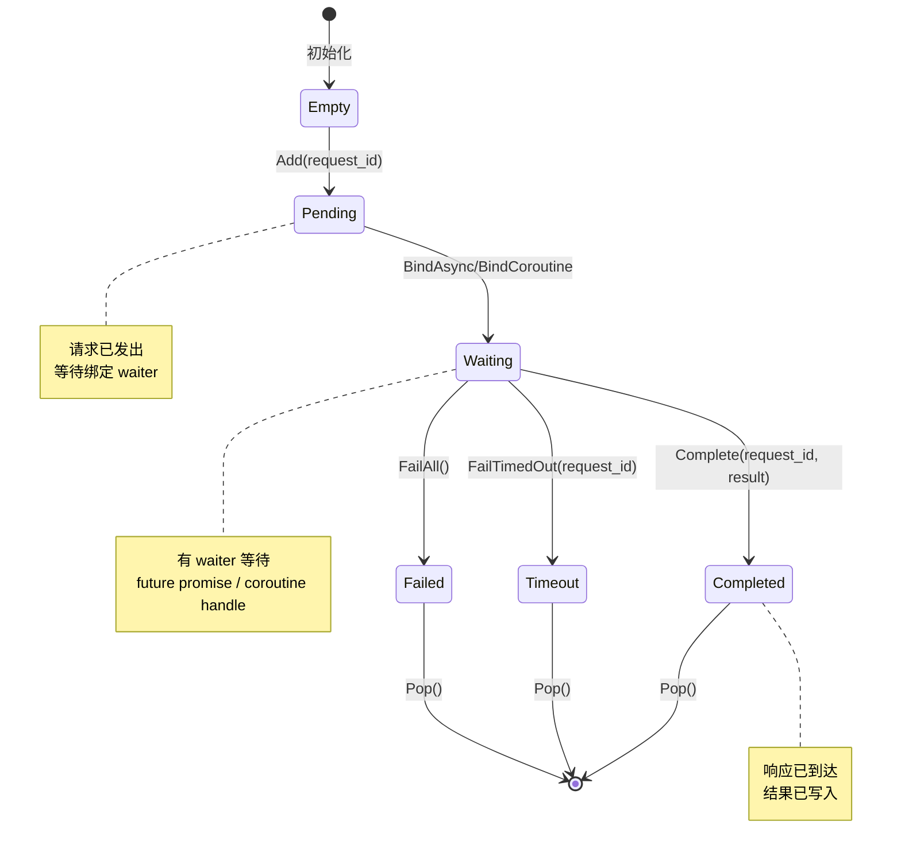

---

## 7. WorkerLoop 事件循环流程

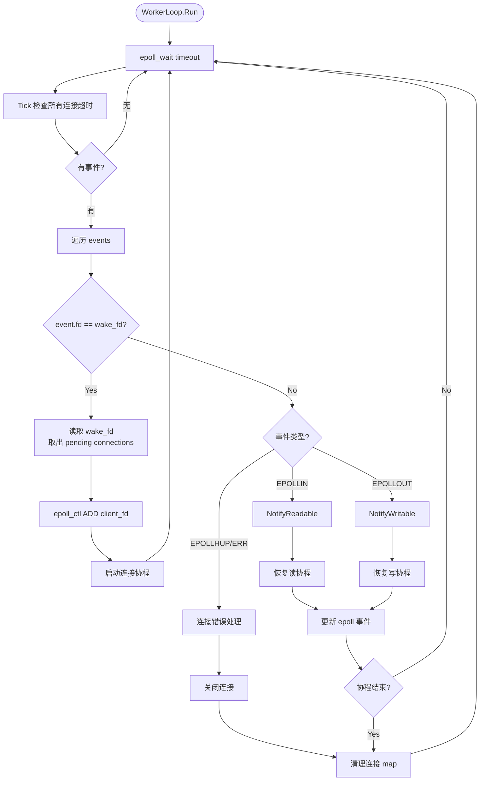

---

## 8. 协程 Awaiter 挂起恢复流程

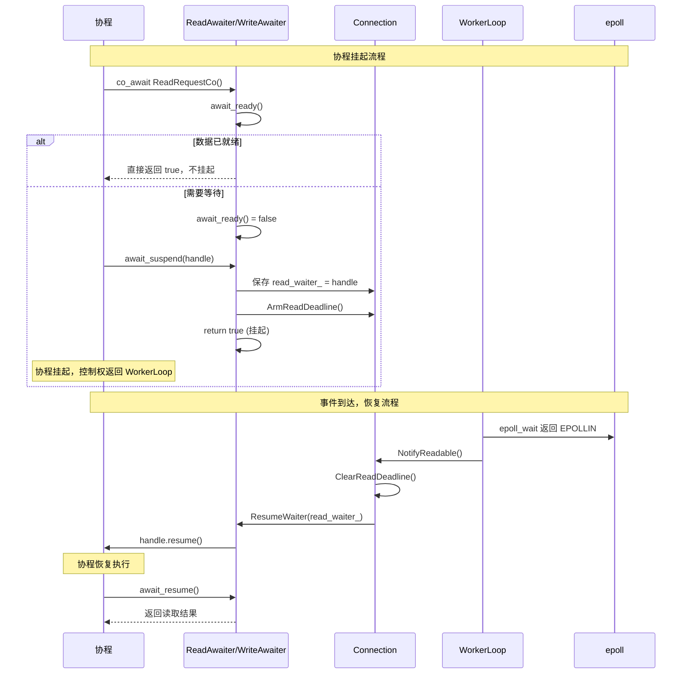

---

## 9. 多线程分发与线程安全

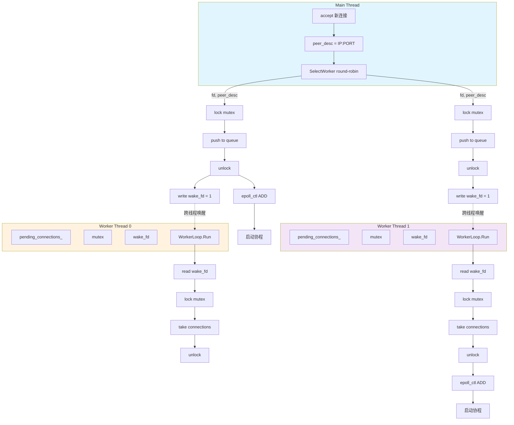

---

## 10. 客户端调用方式对比

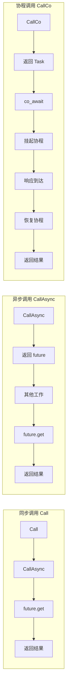

---

## 11. 协议层帧格式

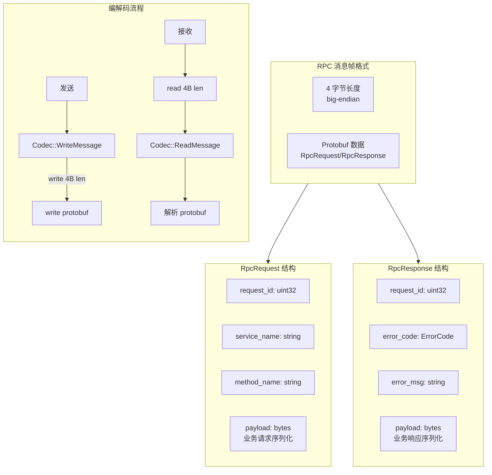

---

## 12. 错误处理体系

```mermaid
flowchart TB
    subgraph ERRORS[错误类型]
        OK[OK = 0<br/>成功]
        MNF[METHOD_NOT_FOUND = 1<br/>方法不存在]
        PE[PARSE_ERROR = 2<br/>解析失败]
        IE[INTERNAL_ERROR = 3<br/>内部错误]
    end

    subgraph FLOW[错误处理流程]
        direction TB
        CALL[调用请求] --> LOOKUP{查找方法}
        
        LOOKUP -->|找到| PARSE{解析请求}
        LOOKUP -->|未找到| MNF_RESP[返回 METHOD_NOT_FOUND]
        
        PARSE -->|成功| EXEC{执行 Handler}
        PARSE -->|失败| PE_RESP[返回 PARSE_ERROR]
        
        EXEC -->|成功| BUILD[构建响应]
        EXEC -->|异常| IE_RESP[返回 INTERNAL_ERROR]
        
        BUILD --> OK_RESP[返回 OK + payload]
    end

    subgraph CLIENT[客户端错误处理]
        RESP[收到响应] --> CHECK{error_code?}
        CHECK -->|OK| SUCC[解析 payload]
        CHECK -->|非 0| FAIL[返回 Status(error)]
    end

    style OK fill:#c8e6c9
    style MNF fill:#ffcdd2
    style PE fill:#ffcdd2
    style IE fill:#ffcdd2
```

---

## 13. 连接生命周期状态机

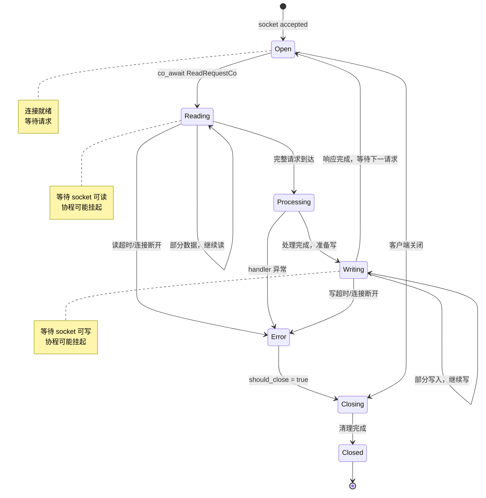

---

## 14. 测试覆盖矩阵

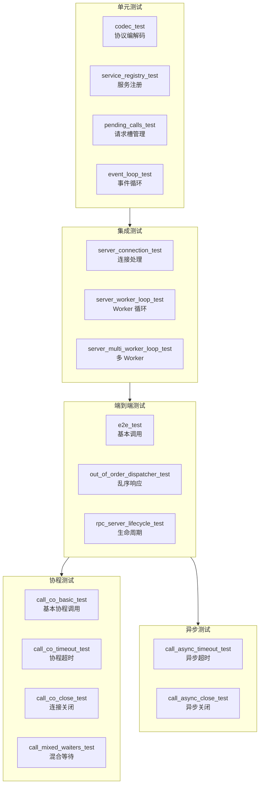

---

## 15. 目录结构图

```mermaid
flowchart TB
    ROOT[rpc_project/] --> CMAKE[CMakeLists.txt]
    ROOT --> README[README.md]
    
    ROOT --> SRC[src/]
    SRC --> CLIENT[client/]
    CLIENT --> C1[rpc_client.*]
    CLIENT --> C2[event_loop.*]
    CLIENT --> C3[pending_calls.*]
    CLIENT --> C4[rpc_types.h]
    
    SRC --> SERVER[server/]
    SERVER --> S1[rpc_server.*]
    SERVER --> S2[worker_loop.*]
    SERVER --> S3[connection.*]
    SERVER --> S4[service_registry.*]
    
    SRC --> PROTOCOL[protocol/]
    PROTOCOL --> P1[codec.*]
    
    SRC --> COMMON[common/]
    COMMON --> CO1[rpc_error.h]
    COMMON --> CO2[unique_fd.h]
    COMMON --> CO3[log.h]
    
    SRC --> COROUTINE[coroutine/]
    COROUTINE --> COR1[task.h]
    COROUTINE --> COR2[future_awaiter.h]
    
    SRC --> DEMO[demo/]
    DEMO --> D1[server_main.cpp]
    DEMO --> D2[client_main.cpp]
    DEMO --> D3[coroutine_client_main.cpp]
    
    ROOT --> PROTO[proto/]
    PROTO --> PR1[rpc.proto]
    PROTO --> PR2[calc.proto]
    PROTO --> PR3[user.proto]
    
    ROOT --> TESTS[tests/]
    TESTS --> T1[e2e_test.cpp]
    TESTS --> T2[codec_test.cpp]
    TESTS --> T3[...]
    
    ROOT --> DOCS[docs/]
    DOCS --> DOC1[architecture_diagrams.md]
    DOCS --> DOC2[multi_worker_architecture.md]
    
    ROOT --> BENCH[benchmarks/]
    BENCH --> B1[rpc_benchmark.cpp]
```

---

## 图例说明

| 图表 | 说明 |
|------|------|
| 1. 整体架构分层图 | 展示框架的分层结构和模块依赖关系 |
| 2. 服务端架构详图 | 展示服务端多线程 Worker 架构 |
| 3. 客户端架构详图 | 展示客户端 EventLoop 和请求管理 |
| 4. 请求响应完整时序图 | 展示一次完整 RPC 调用的时序 |
| 5. 服务端连接协程流程图 | 展示连接级协程的处理流程 |
| 6. PendingCalls 状态管理图 | 展示请求槽的状态转换 |
| 7. WorkerLoop 事件循环流程 | 展示 Worker 事件循环细节 |
| 8. 协程 Awaiter 挂起恢复流程 | 展示协程挂起和恢复机制 |
| 9. 多线程分发与线程安全 | 展示跨线程通信机制 |
| 10. 客户端调用方式对比 | 对比三种调用方式 |
| 11. 协议层帧格式 | 展示协议编码格式 |
| 12. 错误处理体系 | 展示错误码和处理流程 |
| 13. 连接生命周期状态机 | 展示连接状态转换 |
| 14. 测试覆盖矩阵 | 展示测试分类和覆盖 |
| 15. 目录结构图 | 展示项目目录结构 |
