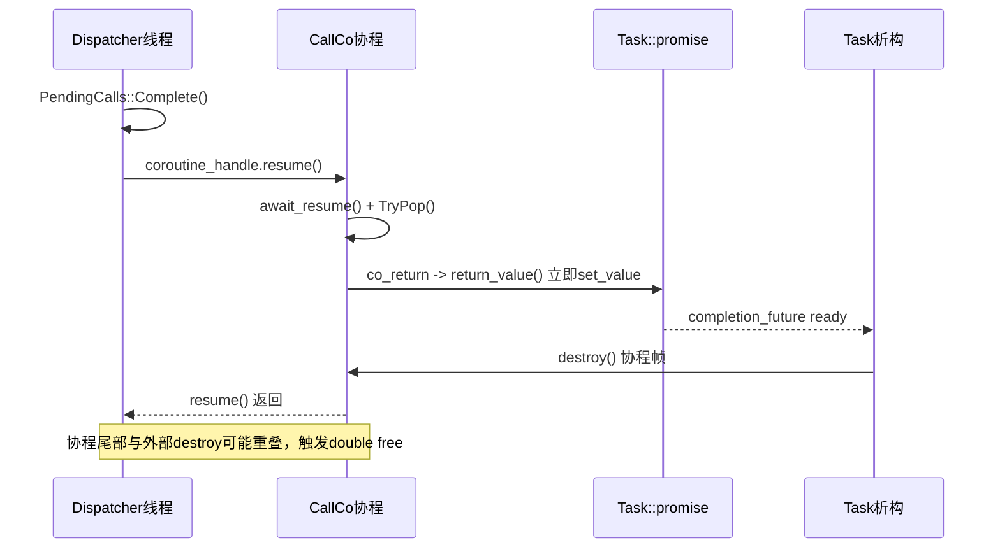
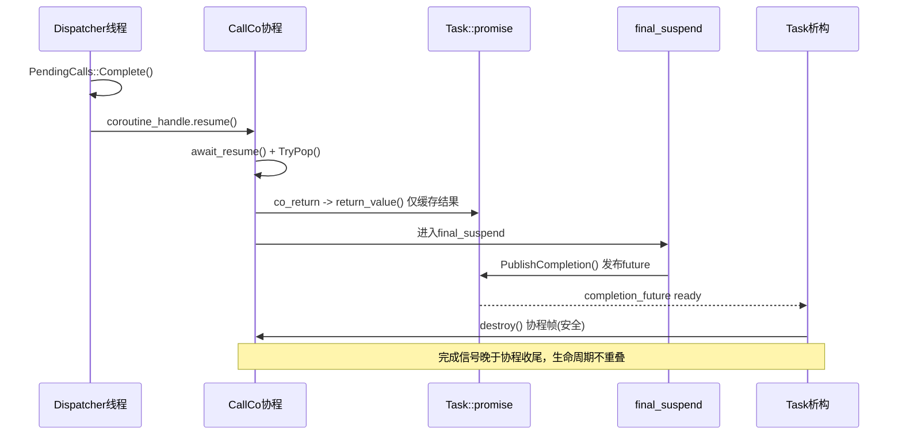

# 协程 Double Free 修复复盘（README）

## 背景

在协程 RPC 调用路径中，压测时出现崩溃：

```
double free detected in tcache 2
```

触发路径是 `CallCo()` + `PendingCalls::Complete()` 的协程恢复分支。AddressSanitizer 栈显示崩溃发生在 dispatcher 线程调用 `coroutine_handle.resume()` 之后。

## 现象与触发条件

1. `RpcClient::CallCo()` 发起请求并进入 `co_await DirectCallCoAwaiter`。
2. dispatcher 在 `PendingCalls::Complete()` 中拿到 `coroutine_handle` 并执行 `resume()`。
3. 协程被恢复后继续执行 `await_resume()`，内部调用 `TryPop()` 取结果并快速 `co_return`。
4. 某些时序下，外部 `Task` 观察到“已完成”并提前销毁协程帧，导致与正在返回的协程执行尾部发生重叠，最终触发 double free。

## 关键结论

ASan 栈里看到的触发点是 `PendingCalls::Complete()->resume()`，但根因不在“resume 本身”，而在“完成信号发布时间过早”：

1. 旧实现里，`Task<T>::promise_type::return_value()` 直接 `set_value`，使 `completion_future` 提前 ready。
2. `Task` 析构 (`Reset`) 依据 `completion_future` 是否 ready 决定是否可 `destroy()` 协程帧。
3. 当 future 先 ready、而协程尚未彻底走完 `final_suspend` 时，可能出现“外部 destroy 与协程尾部并发”的生命周期冲突。

## 修复思路

### 修复 1：完成信号延后到 `final_suspend`

将结果/异常先暂存，不在 `return_value()`/`unhandled_exception()` 直接发布完成；统一在 `final_suspend` 的 awaiter 中调用 `PublishCompletion()`。

目的：保证“对外可见的完成”严格晚于协程执行体结束。

### 修复 2：`final_suspend` 使用对称转移

`FinalAwaiter::await_suspend` 返回 continuation 句柄（或 `std::noop_coroutine()`），而不是在 `final_suspend` 内部手工 `continuation.resume()`。

目的：避免在当前协程的 final_suspend 栈帧内重入恢复 continuation，降低重入销毁带来的未定义行为风险。

### 修复 3：保持 `PendingCalls::Complete()` 的安全边界

`PendingCalls::Complete()` 仍然在锁外执行 `resume()`，仅负责“取出句柄并恢复”；不持锁恢复协程，避免锁重入和阻塞放大。

## 关键代码变更

1. `src/coroutine/task.h`
   - `promise_type` 新增暂存字段：`result_value`、`unhandled_error`、`completion_set`
   - `return_value()` 改为仅保存结果
   - `unhandled_exception()` 改为仅保存异常
   - 新增 `PublishCompletion()`，仅在 `final_suspend` 发布 future
   - `FinalAwaiter::await_suspend()` 返回 continuation 句柄，实现对称转移

2. `src/client/pending_calls.cpp`
   - `Complete()`/`FailAll()`/`FailTimedOut()` 维持“锁内摘句柄，锁外 resume”的模型
   - 协程槽位在恢复前先解绑：`coroutine_bound=false`、`coroutine_handle={}`

3. `src/client/rpc_client.cpp`
   - `CallCo()` 路径保持 `co_return co_await DirectCallCoAwaiter{...}`
   - `DirectCallCoAwaiter::await_resume()` 通过 `TryPop()` 获取结果并返回

## 时序对比

### 旧时序（有风险）

1. 协程 `co_return`
2. `return_value()` 立即 `set_value`
3. 外部 `Task` 认为已完成并 `destroy()`
4. 协程实际仍在返回尾部/`final_suspend` 路径
5. 发生双重释放/内存踩踏



### 新时序（修复后）

1. 协程 `co_return` 仅暂存结果
2. 进入 `final_suspend`
3. `PublishCompletion()` 发布完成信号
4. 外部 `Task` 观测 ready 后再 `destroy()`
5. 生命周期有序，避免重叠销毁



## 验证结果

已做高频回归，包含你新增的边界用例：

```bash
cd rpc_project/build

# 你新增的边界测试
timeout 10s ./call_co_edge_cases_test

# 连续 20 轮稳定性回归
for i in {1..20}; do timeout 10s ./call_co_edge_cases_test; done

# 混合等待者回归
for i in {1..20}; do timeout 10s ./call_mixed_waiters_test; done
```

结果：连续回归通过，未再复现 `double free detected in tcache 2`。

## 经验总结

1. `resume()` 是同步执行，调用点后的代码必须假设“协程可能已跑到 final_suspend”。
2. 协程完成信号不能早于真实生命周期终点，否则外部所有权判断会失真。
3. `final_suspend` 的 continuation 恢复建议使用对称转移，而非手动嵌套 `resume()`。
4. 高并发 + 多轮短超时回归能更快暴露生命周期竞态。